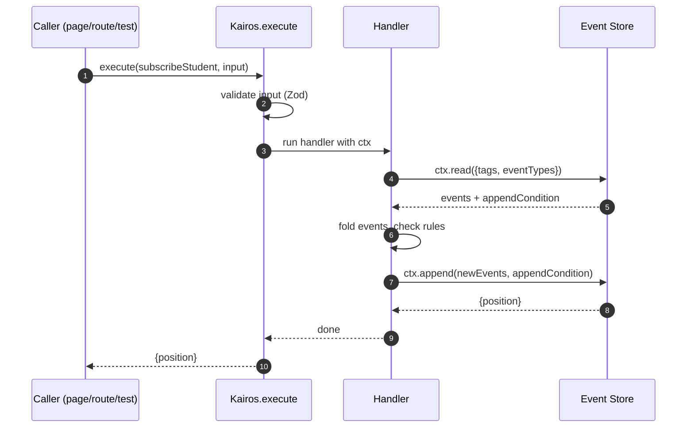
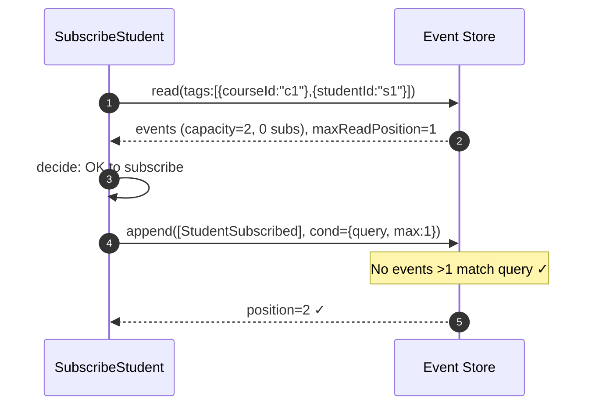
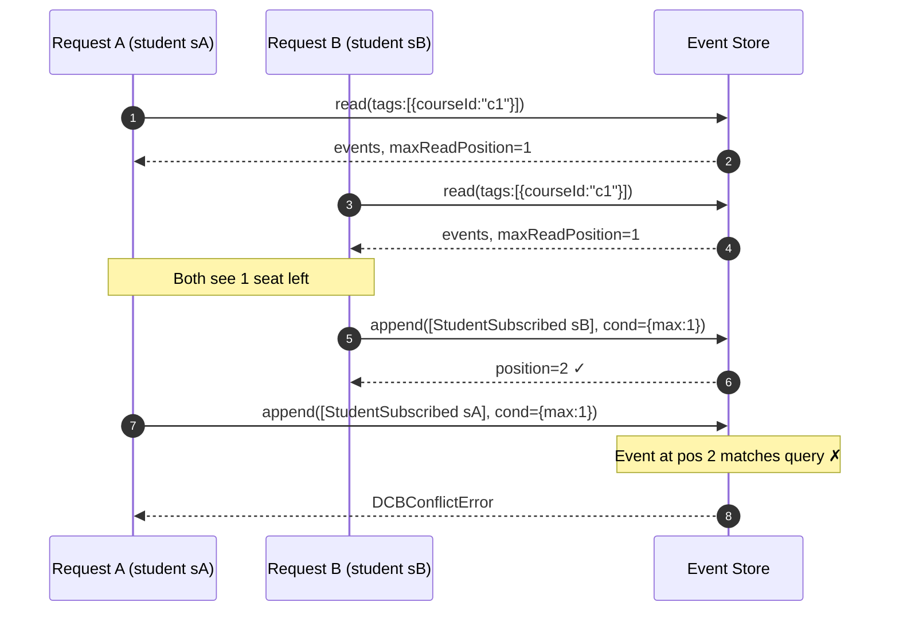
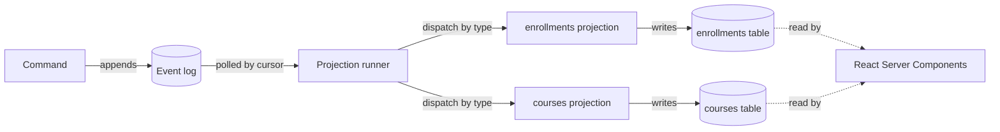

# Concepts

This page walks through the ideas Kairos is built on by solving one concrete problem. By the end you'll understand events, commands, projections, and — the thing the framework is named after — Dynamic Consistency Boundaries.

If you're brand new to event sourcing and CQRS, you'll pick up the essentials here. If you want a deeper dive later, Martin Fowler's [Event Sourcing](https://martinfowler.com/eaaDev/EventSourcing.html) and [CQRS](https://martinfowler.com/bliki/CQRS.html) posts are the classics.

---

## The problem

You're building a course-registration feature. A student clicks Subscribe. Two rules must hold:

1. A course has a fixed capacity. The last seat can be taken only once.
2. A student can be in at most five courses.

In a CRUD app this feels deceptively simple — an `INSERT` into `enrollments` with a few checks. But now imagine two students click Subscribe at the exact same moment for the last remaining seat. Who wins?

If you've shipped this kind of feature before, you know what comes next: row locks, `SELECT FOR UPDATE`, careful transaction isolation, subtle bugs. Maybe you split the rules across two services and chase phantom overbookings in production.

Kairos is built around a different answer. Let's build it up one idea at a time.

---

## Idea 1: facts instead of rows

Instead of storing the *current state* in a table you mutate, you store the *stream of things that happened* and never mutate anything.

When a course is created, you write:

```ts
{ type: 'CourseCreated', tags: { courseId: 'c1' }, data: { title: 'DDD 101', capacity: 2 } }
```

When a student subscribes, you write:

```ts
{ type: 'StudentSubscribed', tags: { courseId: 'c1', studentId: 's1' }, data: {} }
```

That's it. An **event** is a past-tense fact: its type, the data specific to that fact, and a set of **tags** — small key/value labels that say "this fact belongs to this course" or "to this student." Once written, events never change. You always append, never update.

Two consequences matter:

- **History is free.** You never lose information to an `UPDATE`. "Why is the state like this?" is always answerable by reading the events.
- **State is derived, not stored.** Whether a course is full, how many courses a student is in, what a classroom looks like — all computed by replaying the relevant events.

In Kairos, you declare events with Zod schemas:

```ts
import { defineEvent } from 'kairos'
import { z } from 'zod'

export const CourseCreated     = defineEvent('CourseCreated', z.object({ title: z.string(), capacity: z.number().int().positive() }))
export const StudentSubscribed = defineEvent('StudentSubscribed', z.object({}))
```

---

## Idea 2: commands as intent

If events are past-tense facts, what's the present-tense request to make one happen? A **command**. `SubscribeStudent` is a command. It *may fail* — the course might be full — so it's an attempt, not a fact.

A command handler does three things in order: read the events it needs, decide, and append new events.

```ts
import { defineCommand, BusinessRuleError } from 'kairos'

export const subscribeStudent = defineCommand({
  name: 'SubscribeStudent',
  input: z.object({ courseId: z.string(), studentId: z.string() }),
  handler: async ({ courseId, studentId }, ctx) => {
    // 1. read relevant events
    const { events, appendCondition } = await ctx.read({
      tags: [{ courseId }, { studentId }],
      eventTypes: ['CourseCreated', 'StudentSubscribed'],
    })

    // 2. decide
    let capacity = 0, enrolled = 0, studentCourses = 0
    for (const e of events) {
      if (e.type === 'CourseCreated')     capacity = (e.data as { capacity: number }).capacity
      if (e.type === 'StudentSubscribed') {
        if (e.tags.courseId  === courseId)  enrolled++
        if (e.tags.studentId === studentId) studentCourses++
      }
    }
    if (enrolled       >= capacity) throw new BusinessRuleError('Course is full')
    if (studentCourses >= 5)        throw new BusinessRuleError('Student is at limit')

    // 3. append
    await ctx.append(
      [{ type: 'StudentSubscribed', tags: { courseId, studentId }, data: {} }],
      appendCondition,
    )
  },
})
```

A few things to notice:

- **There's no class.** No `Student` aggregate, no `Course` aggregate, no repository. The handler *is* the decider. We'll come back to why.
- **The fold is explicit.** The handler walks over the events it read and builds exactly the state it needs — no more, no less.
- **The append carries an `appendCondition`.** That's the thing in the next section. Keep reading.

The full lifecycle of a command:



---

## Idea 3: Dynamic Consistency Boundaries (DCB)

Now for the central idea.

### The classical headache

Traditional Domain-Driven Design says: group related state into an **aggregate**, make that aggregate the unit of consistency, and enforce that one transaction touches exactly one aggregate. Every invariant has to fit inside one aggregate.

Apply that to our two rules:

- "Course capacity cannot be exceeded" — feels like a rule on `Course`.
- "A student is in at most five courses" — feels like a rule on `Student`.

But *subscribing a student* needs **both** rules to hold at the same time. Where does the rule live? On `Course`? On `Student`? A `SubscriptionService` that touches both aggregates and fights eventual-consistency ghosts? Every option is awkward. This is the hardest call in classical DDD, and most teams get it wrong at least once.

### What DCB does differently

**Dynamic Consistency Boundaries** ([introduced in Axon Framework 5](https://www.axoniq.io/blog/dcb-in-af-5)) flip the model: instead of defining aggregates up front and forcing rules to fit inside them, each *command* declares its own consistency boundary — as a query over events, decided on the spot.

Look back at `subscribeStudent`. The handler says:

```ts
await ctx.read({
  tags: [{ courseId }, { studentId }],
  eventTypes: ['CourseCreated', 'StudentSubscribed'],
})
```

That query is the consistency boundary for *this* command. It says: "to make this decision correctly, I need to read the events tagged with this course OR this student, of these types. And I want to be certain that no new events matching this query appear between now and when I append."

The append:

```ts
await ctx.append(events, appendCondition)
```

carries a receipt from the read (`appendCondition = { query, maxReadPosition }`). The store checks, atomically: *has any event matching `query` with `position > maxReadPosition` landed?* If no, it inserts the new events. If yes, it throws `DCBConflictError`.

### DCB in action — the happy path



### DCB in action — two commands racing for the last seat



Request A retries from the top, rereads, finds the course full, rejects cleanly. No race, no phantom, no double-booking — and no lock.

### Why this is better

- **Boundaries span what they need to span.** Our "spans student and course" rule is trivial now: tag events with both `courseId` and `studentId`, query on both.
- **No aggregate refactors.** Change what a command considers consistent by changing its query. No schema change, no moving methods between classes.
- **Smaller blast radius.** Two commands that query unrelated tag sets don't conflict with each other, even if they write the same event types. Concurrency improves without coordination.
- **Invariants live where they're enforced.** The rule about "course full" appears literally in the command that enforces it. No hunting.

---

## Idea 4: projections as read models

The event log is authoritative, but you don't want your pages to replay events every time they render. You want *tables*.

A **projection** is a named handler that listens for specific event types and maintains its own Drizzle table. Kairos runs a background loop that feeds events through each projection in order and tracks a cursor so it knows where it left off.

```ts
import { defineProjection } from 'kairos'
import { pgTable, text, timestamp } from 'drizzle-orm/pg-core'

export const enrollmentsTable = pgTable('enrollments', {
  courseId:  text('course_id').notNull(),
  studentId: text('student_id').notNull(),
  at:        timestamp('at', { withTimezone: true }).notNull(),
})

export const enrollments = defineProjection({
  name: 'enrollments',
  on: {
    StudentSubscribed: async (event, tx) => {
      await tx.insert(enrollmentsTable).values({
        courseId:  event.tags.courseId,
        studentId: event.tags.studentId,
        at:        event.recordedAt,
      })
    },
  },
})
```

Your React Server Component queries the `enrollmentsTable` directly as plain Drizzle. Kairos doesn't sit between your pages and your read model.



### Read-your-own-writes

Projections are **eventually consistent** — they lag the event log by a few milliseconds. If the request that just ran a command needs to read what it wrote, wait for the projection to catch up:

```ts
const { position } = await kairos.execute(subscribeStudent, input)
await kairos.waitForProjection('enrollments', position)
// the projection is now caught up past your command
```

Server actions do this automatically if you say so:

```ts
export const subscribe = toServerAction(subscribeStudent, {
  kairos,
  waitFor: 'enrollments',
})
```

### Rebuilds

Changed your mind about a read model? Run `kairos.rebuild('enrollments')`. The projection table is truncated, the cursor resets to zero, and every event flows through the handler again. No migrations. Read models are disposable by design.

---

## Putting it together

- **Events** are immutable, tagged, past-tense facts.
- **Commands** are functions that read events, decide, and append more events.
- **DCB** guarantees that the events you read can't change between your read and your append — per command, scoped exactly to the boundary that command needs.
- **Projections** are the read side — named, async, rebuildable functions that feed plain Drizzle tables your UI queries directly.

Next: [the getting-started walkthrough](getting-started.html) builds the course-subscription feature end to end.
