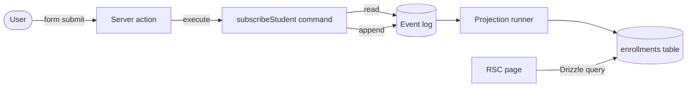

# Getting started

> ⚠️ Kairos is pre-alpha. The in-memory adapter and test harness work today; the Drizzle/Postgres adapter is the next implementation step. The code in this guide shows the intended shape of a Kairos app — you can run the in-memory pieces now and the Postgres pieces soon.

Let's build the canonical Kairos feature: subscribing a student to a course, enforcing two rules that span what would classically be two aggregates.

**The rules:**

- A course has a fixed capacity. It can't be exceeded.
- A student can be in at most 5 courses.

If you haven't read [Concepts](concepts.html) yet, do that first — it explains why this framework works the way it does.

---

## What you're building



The form triggers a server action. The action runs the command. The command reads and appends events under DCB. The projection runner feeds new events into a plain Drizzle table. Your page queries that table directly.

---

## 1. Install

```bash
npm install kairos drizzle-orm zod
# peer deps if you use the Next.js wrappers
npm install next react
```

---

## 2. Define the events

Events are the nouns of your domain. Past-tense, immutable, tagged.

```ts
// src/domain/course/events.ts
import { defineEvent } from 'kairos'
import { z } from 'zod'

export const CourseCreated = defineEvent(
  'CourseCreated',
  z.object({ title: z.string(), capacity: z.number().int().positive() }),
)

export const CourseCapacityChanged = defineEvent(
  'CourseCapacityChanged',
  z.object({ capacity: z.number().int().positive() }),
)

export const StudentSubscribed = defineEvent('StudentSubscribed', z.object({}))
```

You'll tag them with `{ courseId }` and (where relevant) `{ studentId }`. Tags are domain vocabulary — the foreign keys of your event log.

---

## 3. Define the command

The handler reads, decides, appends.

```ts
// src/domain/course/subscribe-student.ts
import { defineCommand, BusinessRuleError } from 'kairos'
import { z } from 'zod'

export const subscribeStudent = defineCommand({
  name: 'SubscribeStudent',
  input: z.object({ courseId: z.string(), studentId: z.string() }),
  handler: async ({ courseId, studentId }, ctx) => {
    const { events, appendCondition } = await ctx.read({
      tags: [{ courseId }, { studentId }],
      eventTypes: ['CourseCreated', 'CourseCapacityChanged', 'StudentSubscribed'],
    })

    let capacity = 0
    let enrolled = 0
    let studentCourses = 0

    for (const e of events) {
      if (e.type === 'CourseCreated')         capacity = (e.data as { capacity: number }).capacity
      if (e.type === 'CourseCapacityChanged') capacity = (e.data as { capacity: number }).capacity
      if (e.type === 'StudentSubscribed') {
        if (e.tags.courseId  === courseId)  enrolled++
        if (e.tags.studentId === studentId) studentCourses++
      }
    }

    if (enrolled       >= capacity) throw new BusinessRuleError('Course is full')
    if (studentCourses >= 5)        throw new BusinessRuleError('Student at course limit')

    await ctx.append(
      [{ type: 'StudentSubscribed', tags: { courseId, studentId }, data: {} }],
      appendCondition,
    )
  },
})
```

The `appendCondition` is the DCB guard — if another request appended a matching event between our read and our append, `ctx.append` throws `DCBConflictError` and the caller retries.

---

## 4. Define a projection

```ts
// src/domain/course/projections.ts
import { defineProjection } from 'kairos'
import { pgTable, text, timestamp } from 'drizzle-orm/pg-core'

export const enrollmentsTable = pgTable('enrollments', {
  courseId:  text('course_id').notNull(),
  studentId: text('student_id').notNull(),
  at:        timestamp('at', { withTimezone: true }).notNull(),
})

export const enrollments = defineProjection({
  name: 'enrollments',
  on: {
    StudentSubscribed: async (event, tx: any) => {
      await tx.insert(enrollmentsTable).values({
        courseId:  event.tags.courseId,
        studentId: event.tags.studentId,
        at:        event.recordedAt,
      })
    },
  },
})
```

This projection reacts to `StudentSubscribed` events only. It writes a row into `enrollments` — the read model your pages will query.

---

## 5. Wire it up

```ts
// src/kairos.ts
import { createKairos } from 'kairos'
import { createDrizzleEventStore } from 'kairos/drizzle'
import { drizzle } from 'drizzle-orm/node-postgres'
import { Pool } from 'pg'

import { CourseCreated, CourseCapacityChanged, StudentSubscribed } from './domain/course/events.js'
import { enrollments } from './domain/course/projections.js'

const pool = new Pool({ connectionString: process.env.DATABASE_URL })
export const db = drizzle(pool)

export const kairos = createKairos({
  store: createDrizzleEventStore({ db }),
  events: [CourseCreated, CourseCapacityChanged, StudentSubscribed],
  projections: [enrollments],
})
```

Start the projection runner when Next.js boots:

```ts
// instrumentation.ts
export async function register() {
  if (process.env.NEXT_RUNTIME === 'nodejs') {
    const { kairos } = await import('./src/kairos.js')
    await kairos.start()
  }
}
```

---

## 6. Use it from a page

```tsx
// app/courses/[id]/page.tsx
import { db } from '@/src/kairos'
import { enrollmentsTable } from '@/src/domain/course/projections'
import { subscribeStudent } from '@/src/domain/course/subscribe-student'
import { toServerAction } from 'kairos/next'
import { kairos } from '@/src/kairos'
import { eq } from 'drizzle-orm'

const subscribe = toServerAction(subscribeStudent, {
  kairos,
  waitFor: 'enrollments', // projection must catch up before the action returns
})

export default async function CoursePage({ params }: { params: { id: string } }) {
  const rows = await db
    .select()
    .from(enrollmentsTable)
    .where(eq(enrollmentsTable.courseId, params.id))

  return (
    <>
      <ul>{rows.map(r => <li key={r.studentId}>{r.studentId}</li>)}</ul>
      <form action={async (fd) => {
        'use server'
        await subscribe({
          courseId:  params.id,
          studentId: String(fd.get('studentId')),
        })
      }}>
        <input name="studentId" />
        <button>Subscribe</button>
      </form>
    </>
  )
}
```

That's the full feature. Notice the RSC query is plain Drizzle — Kairos does not stand between your page and your read model.

Prefer a REST endpoint? `toRouteHandler` is the equivalent wrapper for `app/api/*/route.ts`.

---

## 7. Test it

Tests run against the in-memory adapter. No Postgres, no Docker, millisecond execution.

```ts
// src/domain/course/subscribe-student.test.ts
import { createTestKairos } from 'kairos/testing'
import { BusinessRuleError } from 'kairos'
import { describe, it, expect } from 'vitest'
import { subscribeStudent } from './subscribe-student.js'
import { CourseCreated, StudentSubscribed } from './events.js'
import { enrollments } from './projections.js'

describe('SubscribeStudent', () => {
  it('rejects when the course is full', async () => {
    const k = createTestKairos({
      events: [CourseCreated, StudentSubscribed],
      projections: [enrollments],
    })

    await k.given([
      { type: 'CourseCreated',     tags: { courseId: 'c1' }, data: { title: 'DDD 101', capacity: 1 } },
      { type: 'StudentSubscribed', tags: { courseId: 'c1', studentId: 's1' }, data: {} },
    ])

    await expect(
      k.execute(subscribeStudent, { courseId: 'c1', studentId: 's2' }),
    ).rejects.toThrow(BusinessRuleError)
  })
})
```

`k.given` seeds events directly (skipping command handlers). `k.execute` runs a command. Projections run synchronously in the test harness, so after `execute` returns, your read model is already up to date.

---

## Where to next

- [Concepts](concepts.html) — the mental model behind the API.
- [API reference](api.html) — everything you can import.
- [Design doc](plans/2026-04-15-kairos-design.html) — what's in v0.1, what's deferred, and why.
